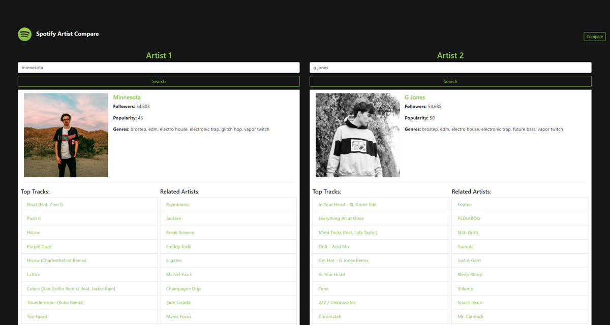

# Spotify Artist Compare

---

### Table of Contents

- [Description](#description)
- [How to Use](#how-to-use)
- [Installation](#installation)
- [Technologies](#technologies)
- [License](#license)
- [Contributors](#contributors)

---

### Description

I built this Spotify Search API tool to get 2 separate artists at the same time to compare details and statistics. This tool is specifically useful when building music festival lineups, but is also a great way to find artist information without needing a Spotify account or using Spotify's main applications.

---

### How to Use

Open the application in your browser and search for an artist. Click the "Compare" button in the top right corner to load a side by side search feature.

---

### Installation

Spotify Artist Compare is live [here](https://spotify-artist-compare.herokuapp.com/)

---

### Technologies

[Spotify Web API](https://developer.spotify.com/documentation/web-api/)\
[React](https://reactjs.org/)\
[Express](https://expressjs.com/)\
[Bootstrap](https://getbootstrap.com/)

---

### License

MIT © [shiftymitch](https://github.com/shiftymitch)

---

### Contributors

| Developer | GitHub |
| ------ | ------ |
| Mitch Henderson | [shiftymitch](https://github.com/shiftymitch) |

[Back to the Top](#project-name)
